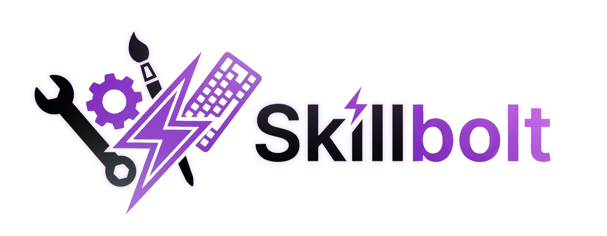

<div align="center">



<div align="center">

## AI 에이전트를 위한 범용 스킬 생태계

<small>한 번 구축하고 어디서나 재사용. Claude Code, Cursor, OpenClaw 등에서 스킬을 실행하세요.</small>

</div>

<p><b>🎨 스킬/인스트럭션 파일을 지원하는 모든 AI 에이전트에서 작동</b></p>

<table>
<tr>

<td align="center" width="100">
  <a href="https://docs.anthropic.com/en/docs/claude-code">
    
  </a><br/>
  <sub>
    <a href="https://docs.anthropic.com/en/docs/claude-code"><b>Claude Code</b></a>
  </sub>
</td>

<td align="center" width="100">
  <a href="https://cursor.com">
    <picture>
      <source media="(prefers-color-scheme: dark)" srcset="https://cdn.simpleicons.org/cursor/FFFFFF">
      
    </picture>
  </a><br/>
  <sub>
    <a href="https://cursor.com"><b>Cursor</b></a>
  </sub>
</td>

<td align="center" width="100">
  <a href="https://github.com/openai/codex">
    
  </a><br/>
  <sub>
    <a href="https://github.com/openai/codex"><b>Codex CLI</b></a>
  </sub>
</td>

<td align="center" width="100">
  <a href="https://continue.dev">
    
  </a><br/>
  <sub>
    <a href="https://continue.dev"><b>Continue</b></a>
  </sub>
</td>

<td align="center" width="100">
  <a href="https://openclaw.ai">
    
  </a><br/>
  <sub>
    <a href="https://openclaw.ai"><b>OpenClaw</b></a>
  </sub>
</td>

<td align="center" width="100">
  <sub><b>+ 커스텀<br/>에이전트</b></sub>
</td>

</tr>
</table>

<div align="center">

<br/>

[🇬🇧 English](../../README.md) •
[🇨🇳 中文](../../README.zh-CN.md) •
[🇯🇵 日本語](./README.ja.md) •
[🇰🇷 한국어](./README.ko.md) •
[🇪🇸 Español](./README.es.md) •
[🇫🇷 Français](./README.fr.md) •
[🇩🇪 Deutsch](./README.de.md) •
[🇧🇷 Português](./README.pt-br.md)<br/>
[🇷🇺 Русский](./README.ru.md) •
[🇸🇦 العربية](./README.ar.md) •
[🇮🇹 Italiano](./README.it.md) •
[🇻🇳 Tiếng Việt](./README.vi.md) •
[🇹🇷 Türkçe](./README.tr.md)

<br/>

<p align="center">
  <a href="https://www.npmjs.com/package/@skillbolt/cli"></a>
  <a href="../../LICENSE"></a>
  <a href="https://www.typescriptlang.org/"></a>
  <a href="https://nodejs.org/"></a>
  <a href="../../CONTRIBUTING.md"></a>
  <br>
  <a href="https://discord.gg/u34Tg5pQ"></a>
  <a href="https://x.com/skillbolt2026"></a>
  <a href="#wechat"></a>
</p>

<details id="wechat">
<summary>📱 WeChat 그룹 참여하기</summary>
<br/>

</details>

<br/>

[빠른 시작](#-빠른-시작) • [기능](#-기능) • [문서](#-문서)

</div>

</div>

<br/>

## 📖 스킬이란?

**스킬**은 AI 에이전트용 휴대 가능한 명령 파일입니다. 트리거, 워크플로, 파라미터를 정의합니다:

```markdown
---
name: git-commit-helper
description: 사용자가 "변경사항 커밋" 또는 "커밋 생성"을 요청할 때 활성화
triggers:
  - commit changes
  - create commit
---

## 워크플로

1. `git add`로 변경사항 스테이징
2. diff를 기반으로 커밋 메시지 생성
3. `git commit`으로 커밋 생성
```

> **스킬은 그냥 마크다운입니다.** 작성하기 쉽고, 공유하기 쉽고, 코드와 함께 버전 관리됩니다.

<br/>

## 🤔 Skillbolt는 어떤 문제를 해결하나요?

AI 코딩 어시스턴트를 사용할 때마다 같은 지시를 반복하고 있지 않나요 — _"conventional commits를 따라"_, _"우리 팀 코드 스타일을 사용해"_, _"보안 문제를 확인해"_...

**AI는 매번 잊어버립니다.**

Skillbolt는 여러분의 지시를 **재사용 가능한 스킬**로 변환하고, LLM 기반 발견과 지능형 실행으로 더 나아갑니다:

<br/>

<table>
<tr>
<td width="33%" align="center">
<h3>🎯 생성</h3>
<p>휴대 가능한 마크다운 파일로 스킬을 한 번 작성. Claude Code, Cursor, Codex 등에서 작동.</p>
</td>
<td width="33%" align="center">
<h3>🧠 발견</h3>
<p>LLM 기반 능력 트리 + 지능형 검색이 모든 작업에 적합한 스킬을 자동 발견.</p>
</td>
<td width="33%" align="center">
<h3>🚀 실행</h3>
<p>자동 생성된 DAG 계획이 멀티 스킬 워크플로를 병렬 실행하고 비용 추적.</p>
</td>
</tr>
</table>

<br/>

## ✨ 기능

**스킬 라이프사이클**

- ⚡ **CLI 우선 워크플로** — 스킬 생성, 검증, 패키징, 배포
- 🧬 **스킬 증류** — AI 대화에서 재사용 가능한 스킬 추출
- 📦 **모듈러 패키지** — 풀 스택 또는 필요한 부분만 사용

**발견 및 라우팅**

- 🌳 **능력 분류 체계** — 수백 개의 스킬을 탐색 가능한 트리로 구성
- 🔍 **지능형 검색** — 프루닝과 레벨 간 랭킹으로 빠른 매칭

**오케스트레이션 및 가시성**

- 📊 **DAG 계획** — 스킬을 병렬 실행 가능한 계획으로 구성
- 🖥️ **웹 대시보드** — 실행 상태, 로그, DAG 뷰어를 실시간으로 표시
- 🐾 **OpenClaw 동기화** — 멀티채널 에이전트 간 스킬 공유

<br/>

## 🚀 빠른 시작

### 1. 설치

```bash
npm install -g @skillbolt/cli
```

<details>
<summary>다른 패키지 매니저</summary>

```bash
pnpm add -g @skillbolt/cli    # pnpm
npx @skillbolt/cli --help      # npx (설치 불필요)
```

</details>

### 2. 설정

Skillbolt의 지능형 기능을 활성화하기 위해 LLM 프로바이더 설정:

```bash
export LLM_API_KEY=sk-...                  # OpenAI 또는 Anthropic 키
export LLM_PROVIDER=openai                 # "openai" | "anthropic"
```

<details>
<summary>선택사항: 프로젝트 레벨 설정</summary>

프로젝트 루트에 `.skillboltrc.json` 생성:

```json
{
  "llm": { "provider": "openai", "model": "gpt-4o-mini" }
}
```

자세한 내용은 **[설정 가이드](../configuration.md)** 참조.

</details>

### 3. 첫 번째 스킬 생성

```bash
skill init my-skill --template standard --platform claude-code
```

### 4. 스킬 발견 및 설치

```bash
skill search git                           # 마켓플레이스 탐색
skill install github:skillbolt/git-master  # GitHub에서 설치
```

### 5. 검증

```bash
skill lint ./my-skill --fix
```

<br/>

## 📚 문서

📖 **[전체 문서 보기](../)** — 모든 가이드, 레퍼런스, 아키텍처 문서

### 시작하기

- **[설치 가이드](../getting-started.md)** — 사전 요구사항, 설정, 첫 Skillbolt 프로젝트
- **[SKILL.md 형식](../skill-format.md)** — 스킬 파일 사양 — 트리거, 워크플로, 파라미터, 메타데이터
- **[명령어 레퍼런스](../commands.md)** — 20개 이상의 CLI 명령어 완전 문서화
- **[설정](../configuration.md)** — 환경 변수, `.skillboltrc.json`, LLM 프로바이더 설정

### 핵심 개념

- **[런타임 인텔리전스](../runtime-intelligence.md)** — 능력 트리, 지능형 검색, DAG 오케스트레이션, 비주얼 대시보드
- **[능력 트리](../runtime-intelligence.md#capability-tree)** — LLM 기반 분류로 수백 개의 스킬을 탐색 가능한 계층으로 구성
- **[지능형 검색](../runtime-intelligence.md#intelligent-search)** — 자동 프루닝을 통한 다중 레벨 트리 탐색
- **[DAG 오케스트레이션](../runtime-intelligence.md#dag-orchestration--execution)** — 자연어에서 병렬 실행 계획 자동 생성
- **[스킬 증류](../skill-format.md#distillation)** — 실제 AI 대화 기록에서 재사용 가능한 스킬 추출

### 아키텍처 및 통합

- **[API 레퍼런스](../api-reference.md)** — 커스텀 통합 및 파이프라인 구축을 위한 프로그래밍 방식 사용법
- **[패키지 아키텍처](../api-reference.md#packages)** — 17개 모듈러 패키지 — 풀 CLI 또는 개별 컴포넌트
- **[OpenClaw 통합](../openclaw-integration.md)** — OpenClaw 게이트웨이를 통해 13개 이상의 메시징 채널에서 스킬 동기화 및 공유
- **[크로스 플랫폼 지원](../skill-format.md#platforms)** — 한 번 작성하면 Claude Code, Cursor, Codex CLI, Continue 등에서 실행

### 개발

- **[기여하기](../../CONTRIBUTING.md)** — 개발 환경 설정, 빌드 지침, 테스트, PR 워크플로
- **[GitHub Issues](https://github.com/TacoSkill/Skill-Kit/issues)** — 버그 리포트, 기능 요청, 로드맵 논의
- **[Discord 커뮤니티](https://discord.gg/u34Tg5pQ)** — 도움, 스킬 공유, 개발자와 교류
